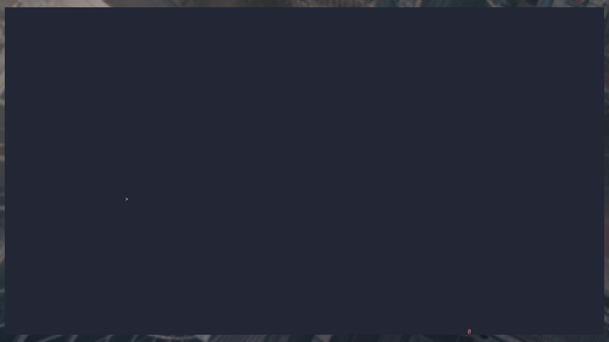

<h1 align=center>csnake</h1>

<div align=center>


<div align=left>

### What is it ?
- This project is fully made in c and made for terminals thanks to the ncurses library.
- A classic recreation of the original game;

<div align=center>



<div align=left>

### Features
- Move the snake with the arrows up, down, left and right.
- You can increase the size of the snake by eating apples.
- **Be careful**, don't bite your own tail, or you'll lose.

### Dependencies
- clang
- Ncurses library
- If you wanna download the dependencies required you can just execute the bash script named ```install_dependencies.sh``` :
```
chmod 777 install_dependencies.sh
./install_dependencies.sh
```

### How to play the game ?
- First of all you need to compile the source files with one of these commands :

```
make
```
<div align=center>

   **or**
<div align=left>

```
make re
```
- Then you have an executable named ```csnake```.
- You can start the game by entering this command in the terminal :
```
./csnake
```
- Lastly you can clean the directory with this command :
```
make fclean
```

### Enjoy playing my game !
